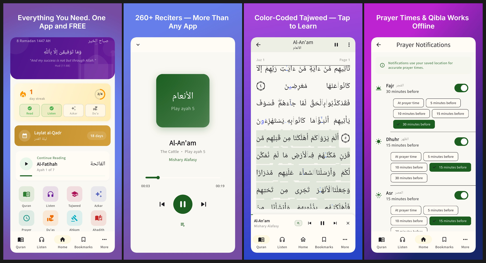
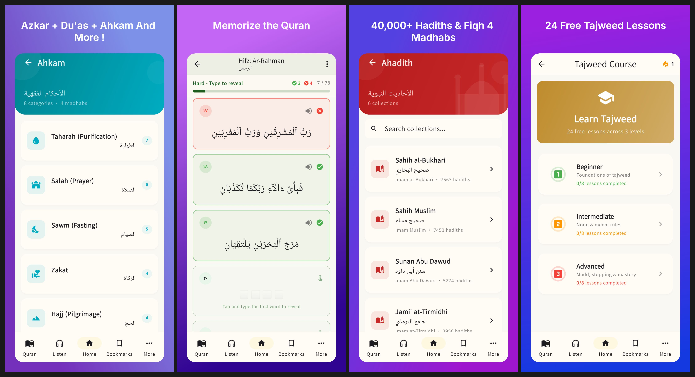

  

  

<h1 align="center">Qurani قُرآني</h1>

  <strong>The all-in-one Islamic app that other apps charge you for — completely free.</strong> 
  No ads. No subscriptions. No "premium" lock. Every feature, every reciter, every lesson — free for the sake of Allah.

  
  
  
  

  <code>260+ Reciters</code> &nbsp;·&nbsp;
  <code>40,000+ Hadiths</code> &nbsp;·&nbsp;
  <code>132 Azkar Categories</code> &nbsp;·&nbsp;
  <code>24 Tajweed Lessons</code> &nbsp;·&nbsp;
  <code>14 Languages</code> &nbsp;·&nbsp;
  <code>5 Home Widgets</code>

<em>Built with love as Sadaqah Jariyah (ongoing charity)</em>

---

## Why Qurani?

Most popular Islamic apps either lock features behind a paywall or only cover one area (just prayer times, just audio, just reading). Qurani gives you **everything in one app, for free**.

| Feature | Qurani | Muslim Pro | Athan | Quran.com | Tarteel |
|---------|:------:|:----------:|:-----:|:---------:|:-------:|
| **Reciters** | **260+** | ~40 | ~10 | ~20 | ~10 |
| **Tajweed course** | **24 lessons FREE** | No | No | No | Premium |
| **Record & compare** | **FREE** | No | No | No | Premium |
| **Hadiths** | **40,000+** (6 collections) | Limited | No | No | No |
| **Azkar** | **132 categories** | Basic | Basic | No | No |
| **Du'as** | **23 categories** | Basic | No | No | No |
| **Fiqh / Ahkam** | **4 madhabs** | No | No | No | No |
| **Hifz mode** | **3 levels FREE** | Premium | No | No | Premium |
| **Offline downloads** | **FREE** | Premium | No | Partial | No |
| **Home screen widgets** | **5 widgets** | Premium | 1 | No | No |
| **Gamification** | **Goals + streaks + badges** | No | No | No | No |
| **Prayer reminders** | **Per-prayer + offsets** | Yes | Yes | No | No |
| **Islamic events** | **10 events + countdown** | Yes | Yes | No | No |
| **Themes** | **4** (Light/Dark/Sepia/AMOLED) | 2 | 2 | 2 | 1 |
| **Price** | **Free forever** | $4.99/mo | Ads | Free | $9.99/mo |
| **Ads** | **None** | Yes (free tier) | Yes | No | No |

---

## Features

### Read the Quran Your Way
- **Recitation mode**: ayah-by-ayah cards with optional translation (24 translations, 20+ languages)
- **Mushaf mode**: authentic page-by-page layout
- Tajweed color-coded text — all 17 rules highlighted, tap any word to learn
- Auto-save your reading position — pick up exactly where you left off
- Audio auto-scroll: the text follows along as you listen
- Bookmark any ayah, search Arabic + translation, access tafsir with one tap

### Listen to 260+ Reciters
More than any other app. Mishary, Sudais, Abdul Basit, Maher Al Muaiqly, and 256+ more.
- Stream or download entire surahs for offline listening
- Background playback with notification + lock screen controls
- Playback modes: Single, Continuous, Repeat Surah, Repeat Ayah
- Mini player stays visible across all tabs

### Learn Tajweed — 24 Free Lessons
No other app teaches all tajweed rules for free.
- 3 levels: Beginner (8), Intermediate (8), Advanced (8)
- Theory, sheikh audio examples, practice exercises, and quizzes
- Record yourself and compare side-by-side with the sheikh
- 70% pass threshold with progress tracking

### Prayer Times, Qibla & Reminders
- Offline calculation from GPS — works without internet (12 methods: MWL, Egyptian, Umm Al-Qura, ISNA, Karachi, etc.)
- Live countdown to next prayer
- Per-prayer notification reminders (at time, or 5/10/15/30 min before)
- Qibla compass with real-time bearing
- Hijri calendar + 10 Islamic events timeline with countdown

### Azkar & Du'as — Complete Hisn al-Muslim
- **132 azkar categories**: morning, evening, prayer, sleep, travel, rain, sickness, and more
- **23 du'a categories**: Istikhara, Anxiety, Travel, Sickness, Tawbah, Hajj, and more
- Tap-to-count tasbih with haptic feedback
- All from HisnMuslim API, cached offline

### 40,000+ Hadiths
- 6 major collections: Bukhari, Muslim, Abu Dawud, Tirmidhi, Nasa'i, Ibn Majah
- Arabic + English text, organized by chapters
- Authenticity grades: Sahih, Hasan, Da'if
- Cached locally for offline reading

### Islamic Rulings (Ahkam) — 4 Madhabs Side by Side
- 8 categories: Purification, Prayer, Fasting, Zakat, Hajj, Marriage, Food, Daily Life
- Each topic shows Hanafi, Maliki, Shafi'i, and Hanbali positions with Quran/Hadith evidence

### Memorize the Quran (Hifz)
- Progressive verse hiding — 3 difficulty levels
- Easy (first word shown), Medium (fully hidden), Hard (type from memory)
- Self-assessment with score tracking

### Gamification — Build Consistent Habits
- 4 daily goals: Read, Listen, Azkar, Du'a
- Daily streak with fire counter
- 15 achievements to unlock
- Celebration confetti when you hit milestones

### Even More
- **Khatmah**: finish the Quran in 30, 60, 90, or 365 days
- **5 home screen widgets**: Daily Ayah, Prayer Time, Hijri Date, Daily Azkar, Hadith of the Day
- **4 themes**: Light, Dark, Sepia, AMOLED
- **14 UI languages**: English, Arabic, French, Turkish, Urdu, Indonesian, Spanish, German, Russian, Bengali, Malay, Hindi, Portuguese, Chinese
- **Offline-first**: everything cached locally after first load

---

## Screenshots

  

  

---

## Download

---

## Feedback & Support

Found a bug or have a feature request? [Open an issue](https://github.com/anasBoudyach/Qurani/issues) — we'd love to hear from you.

For general inquiries: **anas.boudyach@gmail.com**

---

## Support the Project

This app is free and will always be free — no ads, no subscriptions. If you'd like to support the project:

- [**GoFundMe**](https://www.gofundme.com/f/help-build-a-free-allinone-islamic-app-for-everyone) — help bring Qurani to more platforms
- [**GitHub Sponsors**](https://github.com/sponsors/anasBoudyach) — one-time or monthly
- [**Buy Me a Coffee**](https://buymeacoffee.com/anasboudyach) — one-time or monthly
- [**PayPal**](https://paypal.me/AnasBOUDYACH) — direct donation
- [**Rate on Google Play**](https://play.google.com/store/apps/details?id=com.qurani) — free way to support
- Share the app with others
- Make dua for the developers

---

## Privacy Policy

Qurani does **not** collect any personal data. No analytics, no tracking, no ads.

See [PRIVACY_POLICY.md](PRIVACY_POLICY.md) | [Website](https://anas.boudyach.com/privacy/)

---

## Credits

Qurani relies on these amazing open APIs:

| API | Purpose |
|-----|---------|
| [Quran.com](https://quran.com) | Primary text, tajweed, translations, tafsir |
| [Al Quran Cloud](https://alquran.cloud) | Fallback text and audio |
| [MP3Quran](https://mp3quran.net) | 260+ reciters, surah-level audio |
| [EveryAyah](https://everyayah.com) | Verse-by-verse audio |
| [Fawaz Ahmed Hadith API](https://cdn.jsdelivr.net/gh/fawazahmed0/hadith-api@1) | 40,000+ hadiths, 6 collections |
| [HisnMuslim API](https://www.hisnmuslim.com) | 132 azkar/du'a categories |

---

## License

Copyright (c) 2026 Anas Boudyach. All rights reserved. See [LICENSE](LICENSE) for details.

---

<em>بارك الله فيكم — May Allah accept it from us.</em>

